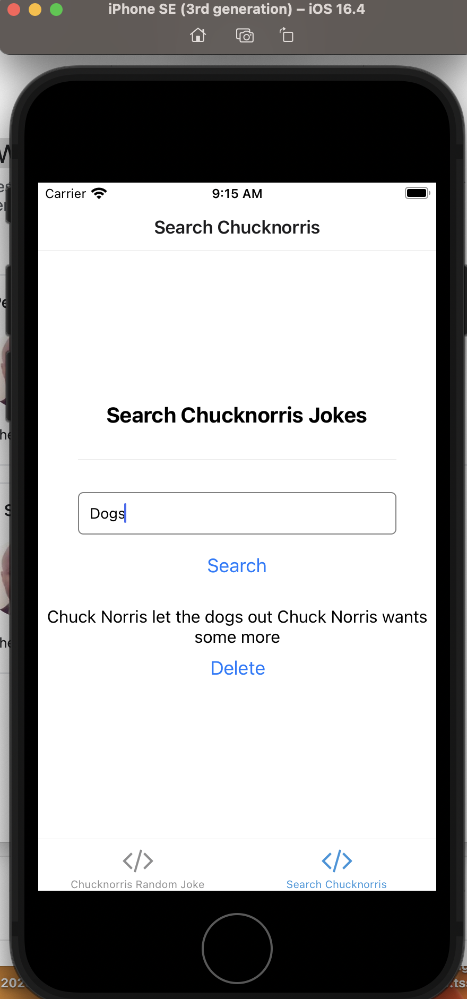

# react-native-chucknorris-jokes-app
#  Chuck Norris REST API
# # Introduction
This project I demonstrate how to consume the Chuck Norris Jokes REST API (https://api.chucknorris.io/) in a React Native application. Chuck Norris jokes are a great way to add some humor to your app, and this API provides a wide range of jokes to choose from.

# Features
Fetch Chuck Norris jokes from the Chuck Norris Jokes API.
Display random jokes or jokes based on categories.
Easily integrate Chuck Norris jokes into my React Native application.

# Prerequisites
Before you begin, ensure you have met the following requirements:

Node.js and npm installed on development machine.
React Native development environment set up.

# Getting Started
To get started with this project, follow these steps:

1. Clone the repository:
`git clone https://github.com/siphesande/react-native-chucknorris-jokes-app.git`

2. Navigate to the project folder:
`cd react-native-chucknorris-jokes-app`

3. Install the dependencies:
`npm install -g expo-cli`
`npm install`

4. Start the Development Server: To start the Expo development server, run:
`expo start`
4. Run the React Native app:
`npm run ios` # For ios

6. Run on Physical Device:

Download the Expo Go app from device's app store (iOS App Store or Google Play Store).
Open the Expo Go app and scan the QR code displayed in your terminal.
My React Native app should open on your physical device.

